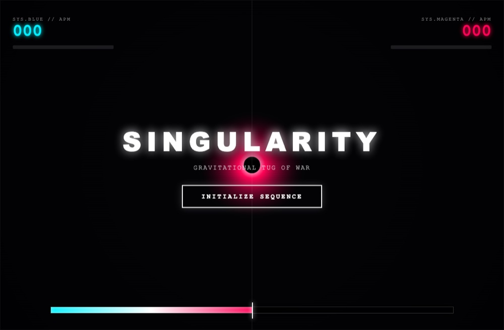

# Singularity: Gravity Collapse

**▶ [Play now](https://renrenmimi.github.io/SINGULARITY-Gravity-Collapse/)** — runs in your browser, nothing to install.

Survive around a collapsing singularity. Mass accumulates, gravity tightens, and eventually
the system hits `CRITICAL MASS ACHIEVED`. Then you reboot and try to last longer.

## Tech

One `index.html` file, Canvas 2D.
